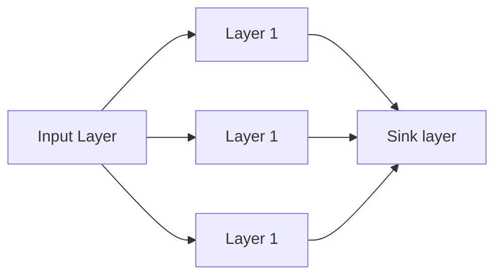

# Метаданные

**Статья: ** 
> Bach, Francis & Jenatton, Rodolphe & Mairal, Julien & Obozinski, Guillaume. (2011). Structured Sparsity through Convex Optimization. Statistical Science. 27. 10.1214/12-STS394. 

**Ссылка: ** [arXiv](https://arxiv.org/abs/1109.2397)

**Тэги: ** #ml/sparsity #math/optimization #ml/group_loss

---

# План статьи

![[bash_structured_sparsity_plan.svg]]

---
# Базовая оптимизационная задача

В статье рассматривается элементарная задача оптимизации линейной модели машинного обучения: 

$$ \min\limits_{w \in R^p} Q(Y, X, \boldsymbol{w}) = \min\limits_{w \in R^p} \sum\limits_{i=1}^{N} l(y^{(i)}, \boldsymbol{x^{(i)}} \boldsymbol{w^{T}}), $$

где $w \in R^p$ - вектор весов линейной модели размерности $p$, $N$ - размер датасета для обучения, $l$ - loss-функция для нужной задачи, $y^{(i)}, x^{(i)}$ - сэмпл из обучающей выборки, ответ и вектор признаков размерности $p$. 

При этом не накладывается никаких ограничений на вектор признаков. Это может быть, например, вектор, полученный после дополнительного преобразования признакового пространства некоторым ядром. 

---
# Неструктурированное разреживание моделей машинного обучения

В некоторых случаях стоит задача одновременно с обучением минимизировать активное количество весов некоторой модели, т.е. занулить какие-то из них. Вектора весов, содержащие большое количество зануленных весов называются разреженными. Потребность в таких весах может быть обусловлена различными причинами. Самые распространенные из них:

1. Уменьшение вычислительной сложности модели #ml/model_computational_complexity. Прореживание сложной нейросетевой модели приводит к большому количеству нулей в матрицах весов и рассчеты на таких матрицах быстрее.
2. Уменьшение размера модели #ml/model_compression. По какой-то причине может быть ограничение на занимаемое моделью пространство в памяти. 
3. Автоматическое определение значимых признаков #ml/features_selection. Нагляднее всего проявляется такое свойство как раз в линейных моделях, где конкретный вес $w_i$ зануляется для конкретного признака.

---
Самый распространненный способ разреживание весов какой-то модели машинного обучения - это использование $L_1$-регуляризатора, или Лассо Тибширани (строго говоря, это название для задачи регрессии) [^1]:

$$ \min\limits_{w \in R^p} Q(Y, X, \boldsymbol{w}) + \lambda \sum\limits_{i=1}^{p} \left|{w_i}\right|, $$

где $\lambda$ - параметр регуляризации. Известно, что при увеличении значения $\lambda$ признаки у модели начинают достаточно быстро и эффективно разреживаться, так что остаются наиболее информативные признаки для решения задачи.

---
**Пороговая функция для веса $w_i$ при использовании Лассо**:

![[weight_shrinkage.png]]

---
**Отбор признаков при использовании L1 регуляризатора**:
![[feature_selection_via_l1_l2.png]]

---
**Еще интересно посмотреть на то как такие нормы как L1 и L2 выглядят в пространстве**:

![[l1_l2_norm_balls.png]]

На такой картинке видно, что в L1-норме "углы" - это точки сингулярности, направленные вдоль осей координат. Именно в них устремится какой-то вес при минимизации.

---
Решение такой задачи напрямую градиентным спуском невозможно, поскольку функция модуля не имеет производной в нулевой точке. Для минимизации таких функций можно использовать [[Проксимальный метод]]. Разбирать тут его не будем, приведем только результат для минимизации:

1. Сделать шаг градиентного спуска
2. Для минимизируемого вектора применить прокс-оператор:

$$ 
prox_{\lambda \left|\cdot\right|}(w_i) = 
\begin{cases} 
	w_i - \lambda,\space if \space w_i \ge \lambda \\
	0,\space if \left|w_i\right| < \lambda \\
	w_i + \lambda,\space if \space w_i \le -\lambda
\end{cases} 
$$

---
И в случае когда стоит задача просто минимизировать количество активных весов некоторой модели, лассо Тибширани прекрасно справляется со своей задачей. Однако, этот метод обладает существенным недостатком: 

> Данный метод не предполагает никакой системности в отборе признаков в том смысле, что признаки будут отбираться по одному в порядке увеличения важности, но никак не глядя на все остальные признаки. Например если в модели признаки $1 \dots 10$ связаны некоторой внутренней логикой, намример, являются весами одного слоя нейроной сети,то L1-регуляризатор не гарантирует, что веса в нейронной сети будут зануляться для всего слоя, даже если он в целом "бесполезный".

# Структурная регуляризация. Основы

Основная идея структурной регуляризации - это объединение весов модели в группы и применение q-нормы к целой группе. Получается в некотором роде разновидность комбинированной $l_1 / l_q$-нормы:

$$ R(W) = \sum\limits_{g \in G} d_g ||w_g||_q, $$
где $w_g \subseteq W$, $G = \{g : g \subseteq W\}$ - множество всех групп весов, $d_g$ - коэффициент регуляризации конкретной группы.

В общем виде такой регуляризатор называется *group loss* #ml/terms/group_loss. Основная задача такого регуляризатора - зануление целой группы весов. При этом очень важен выбор правильных весов для групп, поскольку он может очень сильно повлиять на выбор групп и слишком сильно занулять большие группы весов, игнорируя меньшие. 

Group Loss может быть очень эффективен, когда регуляризируемая модель содержит логические блоки, которые следует рассматривать целиком и если нужно ликвидировать веса в модели, то это должно производиться целыми логическими блоками.

Интересно рассмотреть как работает минимизация такого функционала. Если в случае с $L_1$ нормой решение оптимизационной задачи лежит в районе угловых точек такого шара,  то в случае комбинированной нормы #ml/terms/group_loss с группами решения будут лежать в менее тривиальных точках. 

## Group loss с непересекающимися множествами весов модели

$$ R(W) = \sum\limits_{g \in G} d_g ||w_g||_q, $$ 
$$ \forall g_i \in G , g_j \in G, i \neq j |g_i \cap g_j| = 0 $$

![[disjoint_group_loss.png]]

В таком случае оптимальное решение будет лежать на фигуре, описываемой конкретной группой. Например, если это пример (а), то одно решение лежит на круге, образуемом весами {1.2}, а другое - в вершине, соответствующей весу {3}.

> Важно подчеркнуть тот факт, что нужно очень аккуратно подбирать веса $d_g$ для групп, поскольку размер группы имеет значение и если вес у большой группы будет равен или меньше веса меньшей группы, то с большой вероятностью можно потерять большую группу, которая может быть достаточно информативной.

## Group loss с пересекающимися группами

Наиболее интересный loss - это тот, который учитывает структуру модели. Если group loss с непересекающимися группами может помочь минимизировать веса модели в том случае, если веса логически независимы между группами, то существует group loss, который может учитывать более сложные закономерности.

В общем виде формула для такого loss-а не отлична от предыдущей:

$$ R(W) = \sum\limits_{g \in G} d_g ||w_g||_q, $$

с той лишь разницей, что теперь нет никакого ограничения на пересечение групп весов вежду собой, т.е. $\forall i,j \space |g_i \cap g_j| \ge 0$.

Bach приводит несколько примеров таких group loss'ов:

1. Одномерный group loss
![[1-dimentional_group_loss.png]]
	Здесь темным закрашены группы. В этом случае такой набор групп может выбрать один оптимальный непрерывный поднабор весов.

2. Двумерный group loss
![[2-dimentional_group_loss.png]]
	В этом случае group loss позволяет выбирать произвольные квадраты на плоскости или же треугольники.

3. N-мерный
	Тут сложно что-то описать, но идея, я думаю понятна.

4. Иерархический
![[hierarchial_group_loss.png]]
	В этом случае предполагается что веса завязаны между собой в некоторую иерархию и группы организованы таким образом, чтобы нижележащие поддеревья включались только тогда, когда включается родительское поддерево. Примером может служить какая-то сложная математическая функция, в которой расставили скобки и подставили вес перед каждой скобкой [^2].
	Сам И

[^1]: Tibshirani, R. (1996), Regression Shrinkage and Selection Via the Lasso. Journal of the Royal Statistical Society: Series B (Methodological), 58: 267-288. [https://doi.org/10.1111/j.2517-6161.1996.tb02080.x](https://doi.org/10.1111/j.2517-6161.1996.tb02080.x)
[^2]: Да, в общем-то, нейронная сеть таковой является и чисто теоретически можно было бы выделять группы путей от входных признаков к ответам. 