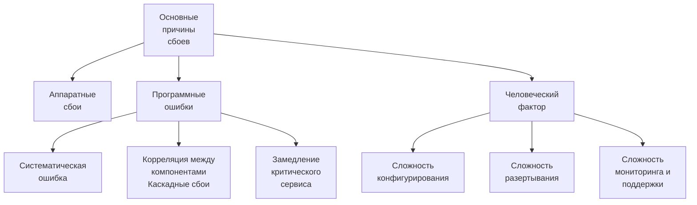

#db/dia_cia
* DIA - Data Intensive Applications. Приложения, нагруженные данными. Приложения, которые вынуждены работать с большим объемом данных и предоставляющие стандартный функционал вроде:
	* хранение больших объемов данных и предоставление доступа к ним другим приложениям;
	* запоминание результатов ресурсоемких вычислений (*кэширование*);
	* поиск по ключевым словам или параметрам (*поисковая индексация*);
	* отправка и хранение сообщений, адресованных другим приложениям (*очереди сообщений*);
	* периодическая обработка больших (очень больших) объемов данных (*пакетная обработка*).
* CIA - Compute Intensive Applications. Приложения, нагруженные вычислениями. Ограничивающий фактор - чистая производительность CPU/GPU, параллелизм и возможность независимой работы вычислительных узлов.

Разработчики баз данных и DIA систем в целом предоставляют приложение, которое обычно оптимизированно под какие-то вполне определенные и ограниченные функции. Так например Redis можно использовать для быстрого сообщения между программами, а Kafka делает тоже самое, но с гарантиями сохранения сообщений как в БД с высоким уровноем надежности. Memcached оптимизирован под кэширование данных, а HDFS под хранение и пакетную обработку больших данных. 

> Разработчики *информационных систем* комбинируют несколько DIA приложений для того чтобы обеспечить требуемую бизнесу функциональность. При этом на плечи разработчиков такой системы ложится необходимость координации нескольких DIA приложений для обеспечения согласованности данных.

![[information_systems.png]]

**Основные вопросы, при разработке DIA приложений и их использования**:
1. *Надежность* - система обеспечивает корректную работу даже при неблагоприятных обстоятельствах, таких как: #db/stability
	* отказ оборудования - выход из строя жестких дисков, повреждение сетевой инфраструктуры; 
	* некорректное использование приложения и его настроек, ограничение несанкционированного доступа;
	* достаточная производительность при плановой нагрузке.

> Интересная статья о тестировании надежности системы с помощью искуcственной имитации сбоев компонент [^1]

2. *Масштабируемость* - приложение должно разрабатываться исходя из плановых нагрузок, выраженных численно таких как *время отклика*, *пропускная способность* и т.п., выраженые в *терминах приложения*. Например, приложение должно обрабатывать 20к запросов/сек, время ответа ленты новостей в Twitter 0.5 сек и т.д. Также метрики должны учитывать требования по SLO/SLA #db/slo_sla #db/scalability

Примеры работы с нагрузкой в Твиттер 

В первом примере твиты для личной страницы новостей запрашивались из общей many-to-many таблицы, что прегружало частые запросы на получение ленты новостей. Второй пример - каждый имеет свою базу ленты новостей. Вторая схема была получена исходя из оценок нагрузки по запросу ленты новостей и публикации твита. Оказалось, что ленту листают чаще и именно ее надо оптимизировать. 

![[twitter_1.png]]

![[twitter_2.png]]

Любая метрика должна рассматриваться исходя из распределения её значений, а не из точечной оценки

![[metrics_percentile.png]]

3. *Удобство сопровождения* - неудобный сервис очень легко вывести из строя, поскольку такой сервис максимизирует человеческий фактор ошибки. Хорошие сервисы должны учитывать несколько факторов: #db/support
	* Удобство эксплуатации - мониторинги, системы развертывания и подробное и понятное логгирование ошибок, нотификации о проблемах, поддержка обновлений и консистентности версий в кластере приложения, простота конфигурирования.
	* Регулярное автоматизированное тестирование приложения, непрерывная интеграция и развертывание.
	* Интегрирование со стандартными утилитами.
	* Качественная, актуальная и понятная документация, понятная операционная модель "если я сделаю X, то получу Y".
	* Простота конфигурирования и его гибкость, если это потребуется. Грамотное использование значений по-умолчанию.
	* Возможности отката и самовостановления сервиса в случае ошибки.
	* Возможность развития сервиса - при необходимости в него должно быть несложно добаить новую функциональность командой разработчиков на поддержке.

[^1]: Izrailevsky Y., Tseitlin A. The Netflix Simian Army. July 19, 2011 (Электронный ресурс). — Режим доступа: https://medium.com/netflix-techblog/the-netflix-simian-army-16e57fbab116.